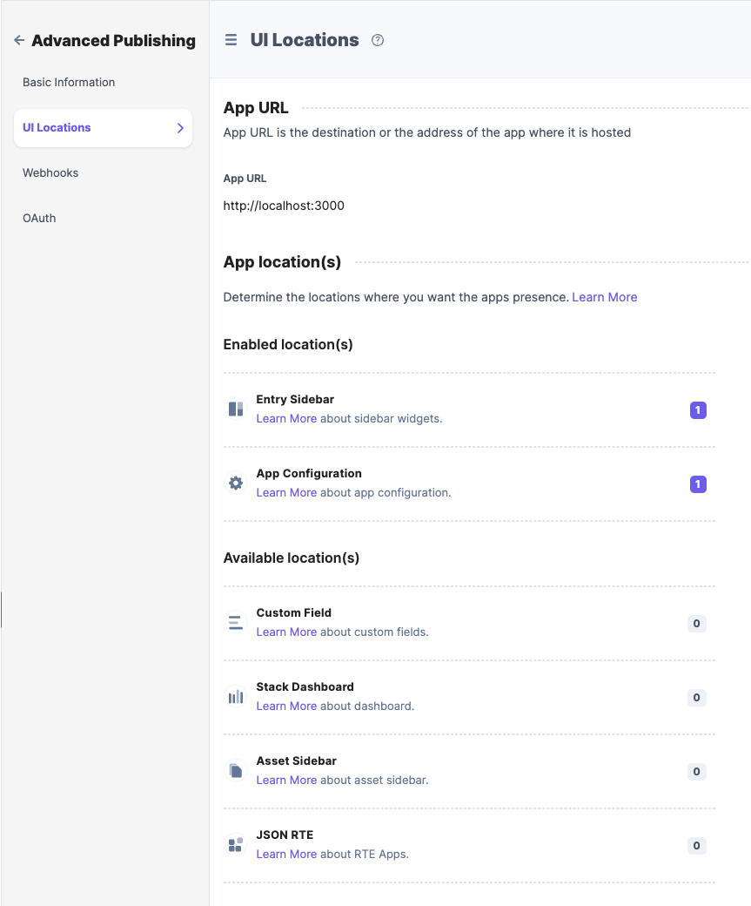
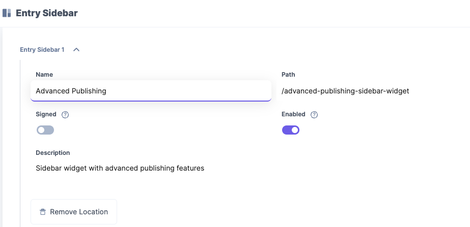

# Introduction

This is a custom app used to provide advanced publishing capabilities.
the implementation also provides examples on how to managed configuration as a JSON text using a code editor. It also provides dummy examples of extensions for custom field, sidebar widget and dashboard widget ui locations. This also has a sample server api that serves a wrapper of Contentstack's Content Management API, with the purpose of hiding api key, tokens and any other sensitive data.

## LICENSE

**_MIT License_**, see LICENSE file for more details.

### Prerequisites

Nodejs - v16.15.0
NPM - 8.5.5 or YARN - 1.22.19

### Installing prerequisites for the extension

1. Application source folder will be referred as APP_DIRECTORY from now on.

1. Go to **&lt;APP_DIRECTORY&gt;/ui** directory in terminal and execute following command `yarn` or `npi i`

1. Go to **&lt;APP_DIRECTORY&gt;/api** directory in terminal and execute following command `yarn` or `npm i`

### Starting the UI and API Servers

1. Go to **&lt;APP_DIRECTORY&gt;/api** directory in terminal and start the server by running `npm start` or `yarn start`. The API server will start at port 8080, or the port you defined in your `.env` file.

1. Go to **&lt;APP_DIRECTORY&gt;/ui** directory in terminal and start the ui react server by running `npm run dev` or `yarn run dev`. The UI server will start at port 3000.

### Creating and updating app in ContentStack

1. Refer https://www.contentstack.com/docs/developers/developer-hub/guide-to-build-your-first-simple-app/ to learn how to create apps.

1. Go to the Developer hub in https://app.contentstack.com and select the NEW_APP. On the top right click on Install App.

1. Select the required stack where the app should get installed.

1. Make sure you add the following UI Locations:

   

   

   

1. After the app is installed in the stack, you can refer the pages developed at various UI locations.

   Below are the various UI locations and their corresponding page in source code:

| UI Location        | Page Source                                                       |
| ------------------ | ----------------------------------------------------------------- |
| **Config Screen**  | &lt;APP_DIRECTORY&gt;/ui/src/containers/ConfigScreen/index.tsx    |
| **Sidebar Widget** | &lt;APP_DIRECTORY&gt;/ui/src/containers/SidebarWidget/index.tsx   |
| _Dashboard Widget_ | &lt;APP_DIRECTORY&gt;/ui/src/containers/DashboardWidget/index.tsx |
| _Custom Field_     | &lt;APP_DIRECTORY&gt;/ui/src/containers/CustomField/index.tsx     |

1. **Note:** The application only really implements the ConfigScreen and the SidebarWidget UI locations, the rest are just boilerplate/mock examples.

1. You can change the source codes and refer the changes in UI now at corresponding places as mentioned above. Once developed as expected, commit the changes to your repo.

### Building and Deploying the app

There are multiple ways you can deploy this app. But basically you need an application server that can host node applications to host the api portion of it. And then a web server to host the UI portion of the extension.

Note that currently the host names for the api is provided via the configuration. Here is a configuration example with some details:

```json
{
  "environments": [
    {
      "name": "production",
      "checked": false
    },
    {
      "name": "staging",
      "checked": true
    },
    {
      "name": "test",
      "checked": false
    }
  ],
  "locales": [
    {
      "code": "en-us",
      "name": "English - United States",
      "checked": true,
      "isMaster": true
    },
    {
      "code": "fr-fr",
      "name": "French - France",
      "checked": false,
      "isMaster": false
    },
    {
      "code": "es-es",
      "name": "Spanish - Spain",
      "checked": false,
      "isMaster": false
    }
  ],
  "splitByLocale": true,
  "maxReleaseItems": 200,
  "endpoint": "http://localhost:8080/cs/api/",
  }
}
```

#### Configuration Details

- **environments**: allows you to configure which environments are going to be
- **locales**: allows you to configure which locales are going to be selected by default.selected by default.
- **splitByLocale**: allows you define if `splitByLocale` is going to be selected by default.
- **endpoint**: The url in which the api portion of the app is accessible/hosted.

**Note:** Once you deploy the ui and api of app, you can update the base url and webhook target url in the app via Developer Hub.
